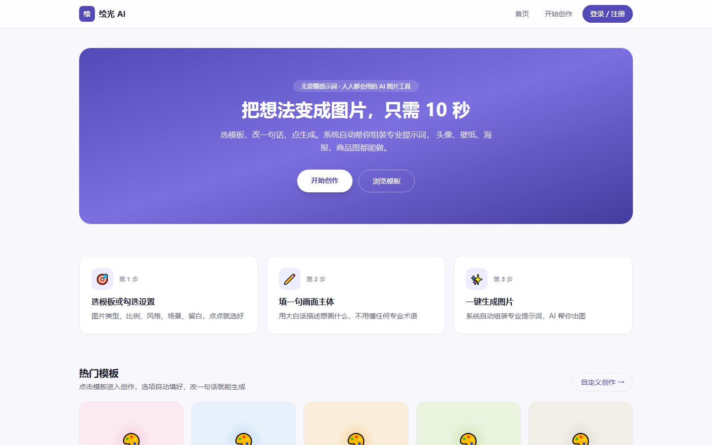
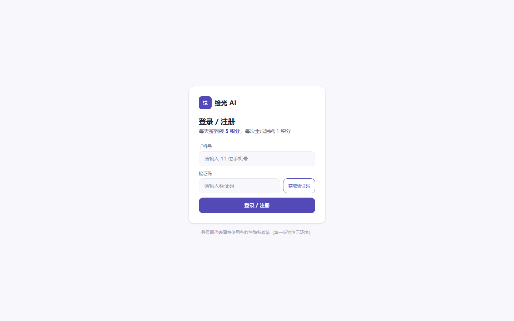

# 绘光 AI · AI 图片生成网站

> 不懂 Prompt 也能 10 秒生成一张专业图片：勾选图片类型、比例、风格、场景、留白，输入主体，系统自动组装成专业英文提示词，调用 AI 绘图 API 出图。



## 🎨 真实出图示例

| 风格 | 主体 | 比例 |
|------|------|------|
| 动漫头像 | 一只戴草帽的橘猫在河边钓鱼 | 1:1 |
| 赛博朋克 | 深夜灯火通明的东京街头 | 16:9 |
| 职场商务 | 手持咖啡的白领在办公室微笑 | 3:4 |

　　　　

> ⚠️ 默认使用智谱 CogView-3-Flash（官方免费）出图，会在右下角带"AI 生成"水印。如需去水印，可在控制台充值后切换到 `cogview-3` 标准版。

## ✨ 功能特性

- **模板直达**：内置 10 个热门模板（微信头像、手机壁纸、小红书封面、电商主图、PPT 配图等），点击自动填好所有选项，改一句话即可生成
- **可视化勾选生成**：图片类型 / 比例 / 风格 / 场景 / 留白 5 组选项，全部中文界面，无需任何 Prompt 基础
- **专业提示词引擎**：勾选项自动组装成结构化英文提示词（`promptBuilder`），生成前实时预览、可复制
- **积分系统**：每天签到领 5 积分，每生成一张扣 1 分；先扣后生成、失败自动退还；积分不足引导签到
- **生成历史**：缩略图网格 + 统计卡片，可查看大图、查看当时选项与提示词、下载图片
- **手机号登录**：第一版用模拟验证码（固定 `123456`），后续可无缝切换真实短信
- **国内直连**：默认接入智谱 CogView-3-Flash，国内网络出图稳定，无需科学上网



## 🛠 技术栈

- **框架**：Next.js 16（App Router + TypeScript + Tailwind CSS 4）
- **数据库**：Prisma + SQLite（本地开发）；部署到 Vercel 时切换 Neon Postgres
- **认证**：JWT（jose）+ httpOnly Cookie
- **绘图 API**：智谱 CogView-3-Flash（默认，国内免费），支持切换硅基流动 / 阿里百炼等其他兼容 OpenAI 的服务
- **部署**：Vercel（推荐）+ Neon Postgres（免费层够用）

## 🚀 本地运行

```bash
git clone https://github.com/fanzekai-eng/huiguang-ai.git
cd huiguang-ai
npm install
npx prisma migrate dev --name init   # 初始化 SQLite 数据库
cp .env.example .env                  # 填写 IMAGE_API_KEY（见下）
npm run dev                           # 打开 http://localhost:3000
```

登录页显示的模拟验证码为 `123456`，任意 11 位手机号都能注册。

## 🔑 获取绘图 API Key

> 截至 2026-08，硅基流动已下架所有免费图像模型（FLUX / SD 系列均不可用），因此本项目**默认使用智谱 CogView-3-Flash**。

### 方式一：智谱 AI（推荐，国内免费）

1. 注册 [智谱开放平台](https://open.bigmodel.cn)（手机号即可，免信用卡）
2. 进入 [API Keys 页面](https://open.bigmodel.cn/usercenter/apikeys) → 点击「创建 API Key」
3. 复制以 `id.` 开头的密钥（或新版 `xxx.xxx` 两段式）
4. 填入 `.env`：
   ```env
   IMAGE_PROVIDER="zhipu"
   IMAGE_API_KEY="你的密钥"
   ```
5. 重启服务 → 真实出图链路打通

**限制**：免费模型输出的图片右下角带"AI 生成"水印。如需无水印版本，充值后切换 `IMAGE_MODEL="cogview-3"`（标准版，约 0.1 元/张起）。

### 方式二：硅基流动 / 阿里百炼 等其他 OpenAI 兼容服务

在 `src/lib/imageApi.ts` 的 `PROVIDERS` 中新增条目，并在 `.env` 配置 `IMAGE_BASE_URL` / `IMAGE_MODEL` 即可。绘图接口调用逻辑无需改动。

## 📦 部署（Vercel + Neon）

1. **创建 Neon 库**：访问 [neon.tech](https://neon.tech)，用 GitHub 账号登录 → 创建免费 Postgres 项目 → 复制连接串（含 `?sslmode=require`）
2. **修改 Prisma provider**：把 `prisma/schema.prisma` 的 `provider = "sqlite"` 改为 `provider = "postgresql"`
3. **本地切换**：`.env` 中 `DATABASE_URL` 改为 Neon 连接串，运行 `npx prisma migrate deploy`
4. **Vercel 导入**：访问 [vercel.com](https://vercel.com) → New Project → 选 `fanzekai-eng/huiguang-ai` 仓库
5. **配置环境变量**（Vercel Project Settings → Environment Variables）：
   - `DATABASE_URL`：Neon 连接串
   - `AUTH_SECRET`：随机长字符串（`openssl rand -hex 32`）
   - `IMAGE_PROVIDER`：`zhipu`
   - `IMAGE_API_KEY`：智谱密钥
6. **触发构建**：Vercel 自动执行 `npm run build`，部署完成后会得到 `*.vercel.app` 公网域名

## 📁 目录结构

```
src/
├── app/
│   ├── page.tsx              # 首页（Hero + 三步介绍 + 模板区）
│   ├── generate/             # 生图页（勾选表单 + 提示词预览 + 结果）
│   ├── history/              # 生成历史（网格 + 统计 + 大图预览）
│   ├── login/                # 登录页（手机号 + 模拟验证码）
│   └── api/
│       ├── auth/             # 登录 / 退出 / me / 签到
│       ├── generate/         # 生成接口（鉴权 → 扣分 → 调 API → 存库 → 失败退分）
│       ├── history/          # 历史列表
│       └── images/[id]/      # 图片输出（鉴权后输出二进制）
├── components/               # 导航栏、升级弹窗、认证 Provider
└── lib/
    ├── promptBuilder.ts      # ★ 提示词组装引擎（核心）
    ├── options.ts            # 勾选项配置（类型/比例/风格/场景/留白）
    ├── templates.ts          # 10 个热门模板
    ├── imageApi.ts           # ★ 绘图 API 适配层（多服务商可插拔）
    ├── dates.ts              # 东八区日期工具（避免签到跨天错乱）
    └── auth.ts / session.ts  # JWT 签发与校验

prisma/
├── schema.prisma             # User + Generation 模型
└── migrations/               # 数据库迁移
```

## 🗺 路线图

- [x] v0.1.0：勾选式生图 + 模板系统 + 签到积分 + 历史 + 智谱出图
- [ ] v0.2.0：图片二次编辑（裁剪/重绘）、参考图上传、更多模板
- [ ] v0.3.0：付费积分包、用户主页、收藏夹
- [ ] v1.0.0：正式上线，多模型（豆包 / 通义万相 / 自研 LoRA）

## 📄 License

MIT